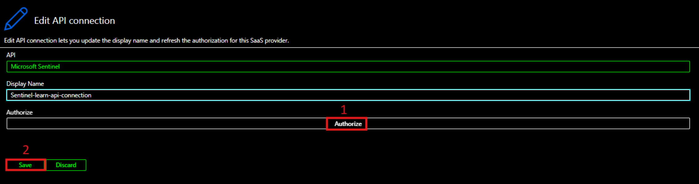

# Microsoft Sentinel IaC

## Purpose

The purpose of this code is to deploy a Sentinel Instance and create an Automation playbook with a trigger already configured with the connection. This also creates the Automation rule to run after incident creation.

## Deployment Process

### Phase 1

Ensure credentials are in order either through CI/CD or DevOps solution.

The alternative is to run **az login** on your choice of terminal to ensure you have to credentials. Then ensure that you have have browsed to the proper directory and run **terraform init**

### Phase 2

***REQUIRED*** Change the **email-to** variable within the **variables.tf** file to a valid email address.

If desired, change any other variable names to required or desired naming stadards using the **variables.tf** file. (***THIS IS HIGHLY RECOMENDED***)

Once comeplete, run terraform apply via pipeline or manually through the terminal.

### Phase 3

Logon to the Azure portal:

[Commercial Azure](https://www.portal.azure.com)

[Government Azure](https://www.portal.azure.us)

In the Search bar, search for API Connections and click on the respective API connection (default = "Sentinel-API-Connection"). Then click on **Edit API Connection** then click **Authorize** then **Save**.

### Phase 4

In the Search bar, search for API Connections and click on the respective API connection (default = "Office365-API-Connection). Then click on **Edit API Connection** then click **Authorize** then **Save**.

